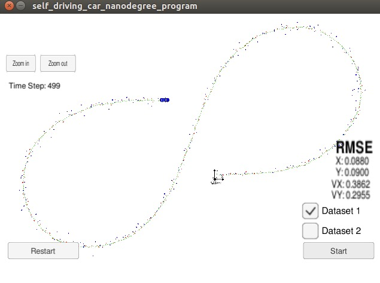

# Unscented-Kalman-Filter

## Project Basics

In this project, I used C++ to write a program taking in radar and lidar data to track position using Extended Kalman 
Filters.

The code will make a prediction based on the sensor measurement and then update the expected position. See files in the 
'src' folder for the primary C++ files making up this project.

## Build instructions

Assuming you have 'cmake' and 'make' already:

* Clone this repo.
* Make a build directory: mkdir build && cd build
* Compile: cmake .. && make
* Run it: ./ExtendedKF

## Datas and Results

Two set of data were used in the simulation. There are some difference between them. The direction of car moving toward is a little different as shown in images below. On dataset 1, the LIDAR measurement data send first, while the RADAR send first in dataset2.
    
In two different simulated runs, my Unscented Kalman Filter produces the below results in the form of [px, py, vx, vy]. The x-position is shown as 'px', y-position as 'py', velocity in the x-direction is 'vx', while velocity in the y-direction is 'vy'.Residual error is calculated by mean squared error (MSE).

Here come the two errors:

 EKF : RMSE <= [0.0965, 0.0854, 0.4158, 0.4321]
 
 UKF : RMSE <= [0.0880, 0.0900, 0.3862, 0.2955]
 
 From the result, we can find that UKF shows a better effect than EKF's, espically in velocity. And I think the parameters could be adjustmented for more trial, which would do better.
 
 EKF:
 
  

UKF:

